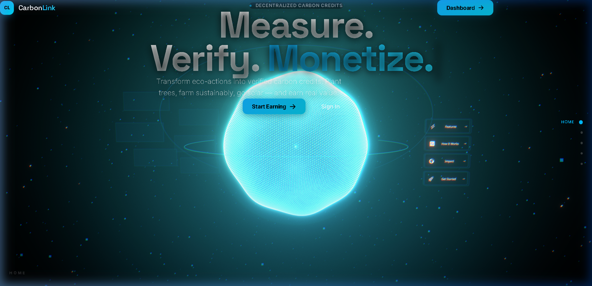
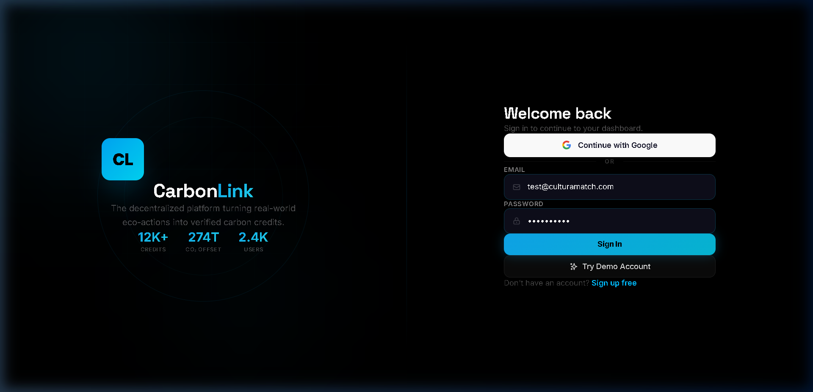
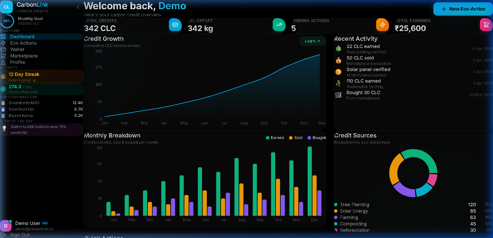
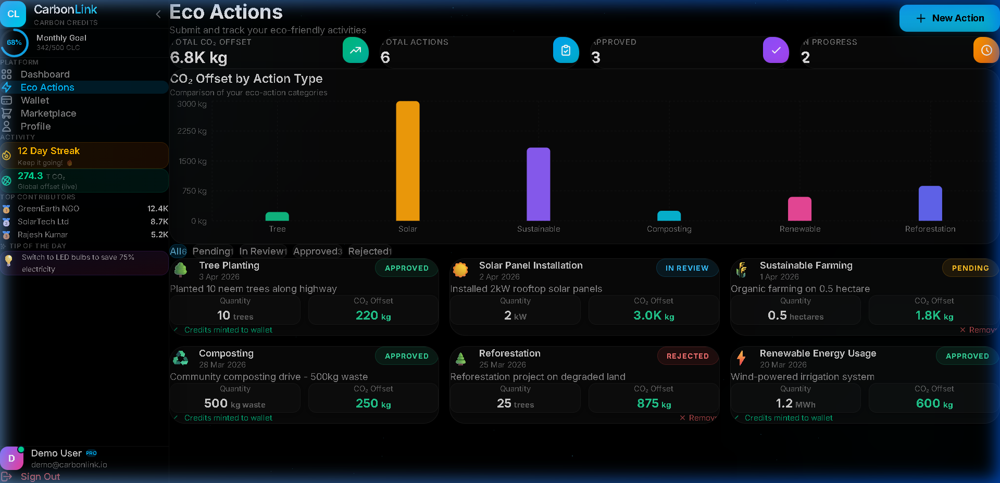
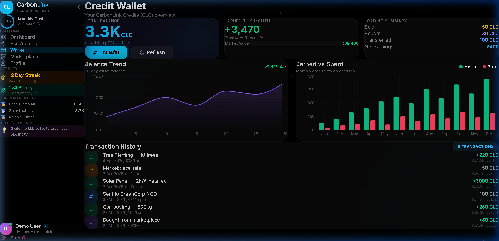
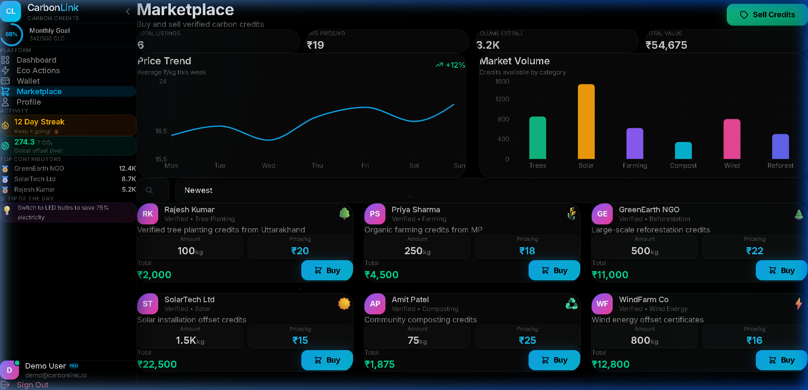
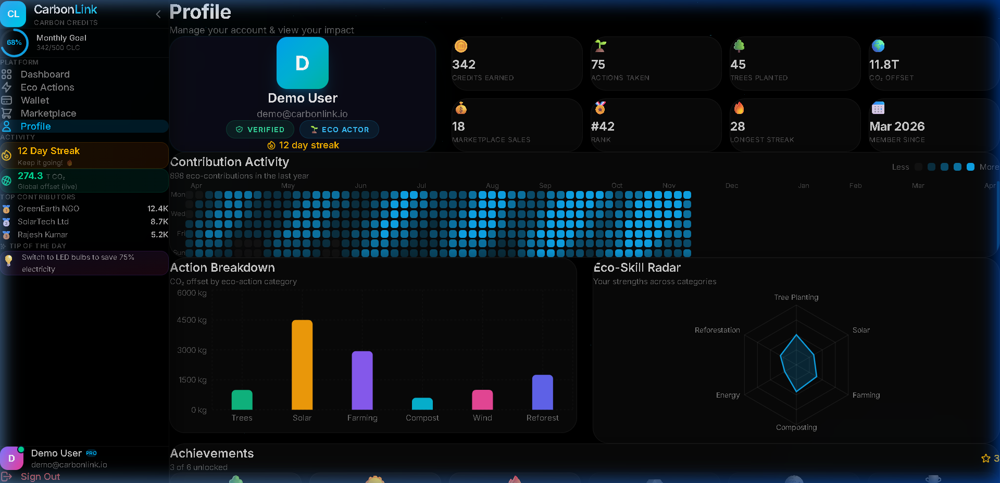

<p align="center">
  
</p>

<h1 align="center">
  🌍 CarbonLink
</h1>

<p align="center">
  <strong>A Full-Stack MERN Application for Decentralized Carbon Credit Management</strong>
</p>

<p align="center">
  
  
  
  
</p>

<p align="center">
  <a href="#-features"></a>
  <a href="#-mern-stack-architecture"></a>
  <a href="#-getting-started"></a>
  
  
  
</p>

<p align="center">
  <a href="#-screenshots">Screenshots</a> •
  <a href="#-architecture">Architecture</a> •
  <a href="#-getting-started">Getting Started</a> •
  <a href="#-api-reference">API Reference</a> •
  <a href="#-contributing">Contributing</a>
</p>

---

## 🎯 What is CarbonLink?

**CarbonLink** is a production-grade **MERN stack** (MongoDB, Express.js, React, Node.js) web application that bridges the gap between **environmental action** and **carbon credit economics**. Users can submit real-world eco-actions — tree planting, solar panel installations, composting, sustainable farming — get them **AI-verified**, and receive **CarbonLink Credits (CLC)** that can be traded on a built-in marketplace.

> 💡 **Think of it as**: GitHub for environmental impact, built on the MERN stack, with a marketplace where your contributions have real monetary value.

### ✨ Why CarbonLink?

| Problem | CarbonLink Solution |
|---------|-------------------|
| Carbon credits are opaque and centralized | Transparent, decentralized credit issuance |
| No way to verify individual eco-actions | AI-powered verification pipeline |
| No incentive for small-scale contributors | Earn, trade, and sell credits from any verified eco-action |
| Complex carbon market interfaces | Beautiful, intuitive glassmorphism UI |

---

## 📸 Screenshots

<details>
<summary><strong>🏠 Landing Page</strong> — Click to expand</summary>
<br/>

<p><em>Immersive 3D WebGL landing with animated rings, parallax effects, and platform statistics.</em></p>
</details>

<details>
<summary><strong>🔐 Login Page</strong> — Click to expand</summary>
<br/>

<p><em>Glassmorphism auth with Google OAuth, magnetic buttons, and cursor glow effects.</em></p>
</details>

<details>
<summary><strong>📊 Dashboard</strong> — Click to expand</summary>
<br/>

<p><em>Real-time credit growth chart, monthly breakdown bar chart, credit source donut, and recent activity feed.</em></p>
</details>

<details>
<summary><strong>🌱 Eco Actions</strong> — Click to expand</summary>
<br/>

<p><em>Submit, track, and manage eco-actions with CO₂ offset visualization and status filtering.</em></p>
</details>

<details>
<summary><strong>💰 Wallet</strong> — Click to expand</summary>
<br/>

<p><em>Balance trend area chart, earned vs. spent comparison, and full transaction history with transfer functionality.</em></p>
</details>

<details>
<summary><strong>🏪 Marketplace</strong> — Click to expand</summary>
<br/>

<p><em>Live price trend, market volume by category, sortable listings with buy/sell modals.</em></p>
</details>

<details>
<summary><strong>👤 Profile</strong> — Click to expand</summary>
<br/>

<p><em>GitHub-style contribution heatmap, eco-skill radar chart, achievement badges, and security settings.</em></p>
</details>

---

## ⚡ Features

### 🎨 Frontend
| Feature | Description |
|---------|-------------|
| **Glassmorphism Design System** | Custom CSS design tokens with `glass`, `glass-strong`, `glass-subtle` variants |
| **Interactive Charts** | 8+ Recharts visualizations — area, bar, donut, radar, line charts |
| **GitHub Contribution Graph** | 52-week heatmap tracking eco-action frequency |
| **3D WebGL Landing** | React Three Fiber with post-processing bloom effects |
| **Micro-Animations** | Framer Motion staggered reveals, magnetic buttons, parallax layers |
| **Smart Sidebar** | Monthly goal ring, live CO₂ counter, streak badge, leaderboard, daily eco-tips |
| **Google OAuth** | One-tap + popup fallback via Google Identity Services |
| **Responsive Design** | Desktop sidebar ↔ Mobile bottom navigation |
| **Toast Notifications** | react-hot-toast for all user actions |

### 🔧 Backend (Node.js + Express + MongoDB)
| Feature | Description |
|---------|-------------|
| **RESTful API** | Express.js with modular route/controller/service architecture |
| **MongoDB + Mongoose** | Full Mongoose ODM with schemas, validators, virtuals & aggregation pipelines |
| **Dual Database Mode** | MongoDB for production, auto-fallback to JSON file DB for zero-config local dev |
| **JWT Authentication** | Secure token-based auth with 7-day expiry |
| **Google OAuth2** | Server-side ID token verification via `google-auth-library` |
| **AI Verification** | Simulated verification pipeline for eco-action submissions |
| **Credit Minting** | Automated CLC credit issuance on action approval |
| **Rate Limiting** | Configurable request throttling per IP |
| **Security Hardening** | Helmet, CORS, XSS sanitization, input validation |

---

## 🏗 MERN Stack Architecture

```
┌──────────────────────────────── MERN STACK ──────────────────────────────┐
│                          CarbonLink Platform                             │
├─────────────────────────────┬────────────────────────────────────────────┤
│    M - MongoDB              │    E - Express.js                          │
│    R - React 19             │    N - Node.js                             │
├─────────────────────────────┼────────────────────────────────────────────┤
│      FRONTEND (React)       │           BACKEND (Express + Node)         │
│                              │                                            │
│  ┌──────────┐ ┌──────────┐  │  ┌───────────┐  ┌───────────────────┐     │
│  │ React 19 │ │ Framer   │  │  │  Routes   │  │   Controllers     │     │
│  │  SPA +   │─│ Motion   │  │  │  /auth    │──│  authController   │     │
│  │ React    │ │ Anims    │  │  │  /eco-act │  │  ecoController    │     │
│  │ Router   │ └──────────┘  │  │  /credits │  │  creditController │     │
│  └────┬─────┘               │  │  /market  │  │  marketController │     │
│       │                      │  │  /verify  │  │  verifyController │     │
│  ┌────▼─────┐ ┌──────────┐  │  └───────────┘  └────────┬──────────┘     │
│  │ Recharts │ │ Three.js │  │                          │                │
│  │ 11 Chart │ │  WebGL   │  │  ┌──────────────────────▼───────────┐     │
│  │  Types   │ │  3D      │  │  │        Services Layer            │     │
│  └──────────┘ └──────────┘  │  │  creditService │ verifyService   │     │
│                              │  │  ipfsService                     │     │
│  ┌────────────────────────┐ │  └──────────────────────┬───────────┘     │
│  │   Context Providers    │ │                          │                │
│  │ AuthCtx │ SidebarCtx   │ │  ┌──────────────────────▼───────────┐     │
│  └────────────────────────┘ │  │    🍃 MongoDB (Mongoose ODM)     │     │
│                              │  │  ┌─────────┐ ┌──────────────────┐│     │
│  Axios ──── /api proxy ──── │──│  │ Users   │ │ EcoActions       ││     │
│                              │  │  │ Credits │ │ Listings         ││     │
│  Port: 5173                 │  │  └─────────┘ └──────────────────┘│     │
│                              │  │  Fallback: JSON File DB (dev)   │     │
│                              │  └─────────────────────────────────┘     │
│                              │  Port: 5000                              │
└─────────────────────────────┴────────────────────────────────────────────┘
```

### MERN Request Flow

```
[React Component] → Axios API Call → [Express Router] → Auth Middleware (JWT)
                                                              │
                                                    [Controller Logic]
                                                              │
                                                     [Service Layer]
                                                              │
                                            ┌─────────────────┴──────────────────┐
                                            │                                    │
                                   [🍃 MongoDB/Mongoose]              [JSON File DB]
                                    (if MONGO_URI set)              (fallback for dev)
                                            │                                    │
                                            └─────────────────┬──────────────────┘
                                                              │
                                                    [JSON Response]
                                                              │
                                                    [React State Update]
```

### MERN Stack Breakdown

| Layer | Technology | Role in CarbonLink |
|-------|-----------|--------------------|
| **M** — MongoDB | Mongoose 8.x ODM | Document storage with schemas, validators, virtuals, aggregation pipelines, and compound indexes |
| **E** — Express | Express 4.21 | RESTful API with 14 endpoints, middleware stack (Helmet, CORS, rate-limit, JWT auth) |
| **R** — React | React 19 SPA | Component-driven UI with Context API, React Router 7, Recharts, Three.js, Framer Motion |
| **N** — Node.js | Node 18+ runtime | Server runtime with ES modules, `--watch` mode, Google OAuth, bcrypt hashing |

---

## 📂 Project Structure

```
CarbonLink/
├── client/                          # Frontend (Vite + React 19)
│   ├── public/                      # Static assets
│   ├── src/
│   │   ├── components/
│   │   │   ├── ui/                  # Reusable UI Components
│   │   │   │   ├── GlassButton.jsx  #   Glassmorphism button variants
│   │   │   │   ├── GlassCard.jsx    #   Glass card container
│   │   │   │   ├── GlassInput.jsx   #   Styled input with icons
│   │   │   │   ├── GlassLoader.jsx  #   Loading spinner
│   │   │   │   ├── GlassModal.jsx   #   Overlay modal dialog
│   │   │   │   ├── GlassNavbar.jsx  #   Top navigation bar
│   │   │   │   ├── GlassSidebar.jsx #   Smart sidebar with widgets
│   │   │   │   └── InteractiveElements.jsx  # CursorGlow, TiltCard, etc.
│   │   │   └── three/               # 3D WebGL components
│   │   ├── context/
│   │   │   ├── AuthContext.jsx      # JWT auth state management
│   │   │   └── SidebarContext.jsx   # Sidebar open/close state
│   │   ├── pages/
│   │   │   ├── Landing.jsx          # Public landing page (3D)
│   │   │   ├── Login.jsx            # Login with Google OAuth
│   │   │   ├── Register.jsx         # Registration with role selection
│   │   │   ├── Dashboard.jsx        # Credit overview & charts
│   │   │   ├── EcoActions.jsx       # Submit & manage eco-actions
│   │   │   ├── Wallet.jsx           # Credit wallet & transfers
│   │   │   ├── Marketplace.jsx      # Buy/sell carbon credits
│   │   │   └── Profile.jsx          # Contribution graph & settings
│   │   ├── utils/
│   │   │   ├── api.js               # Axios instance with interceptors
│   │   │   └── constants.js         # Formatters & action type configs
│   │   ├── App.jsx                  # Route definitions & layout
│   │   ├── main.jsx                 # React DOM entry point
│   │   └── index.css                # Full design system (CSS tokens)
│   ├── .env                         # VITE_GOOGLE_CLIENT_ID
│   ├── package.json
│   └── vite.config.js
│
├── server/                          # Backend (Express.js)
│   ├── data/                        # JSON database files (auto-created)
│   │   ├── users.json
│   │   ├── credits.json
│   │   └── eco-actions.json
│   ├── uploads/                     # File uploads directory
│   ├── src/
│   │   ├── config/
│   │   │   ├── db.js                # MongoDB/Mongoose + JSON DB fallback
│   │   │   └── jsonDb.js            # JSON file database engine
│   │   ├── controllers/
│   │   │   ├── authController.js    # Register, login, Google OAuth
│   │   │   ├── creditController.js  # Credit CRUD operations
│   │   │   ├── ecoActionController.js # Eco-action management
│   │   │   ├── marketplaceController.js # Buy/sell logic
│   │   │   └── verificationController.js  # Action verification
│   │   ├── middleware/
│   │   │   ├── auth.js              # JWT verification middleware
│   │   │   ├── errorHandler.js      # Global error handler
│   │   │   └── upload.js            # Multer file upload config
│   │   ├── models/
│   │   │   ├── User.js              # User model (JSON DB adapter)
│   │   │   ├── Credit.js            # Credit model (JSON DB adapter)
│   │   │   ├── EcoAction.js         # EcoAction model (JSON DB adapter)
│   │   │   └── schemas/             # 🍃 Mongoose Schemas
│   │   │       ├── UserSchema.js    #   User schema + virtuals
│   │   │       ├── CreditSchema.js  #   Credit schema + aggregation
│   │   │       └── EcoActionSchema.js # EcoAction schema + indexes
│   │   ├── routes/
│   │   │   ├── auth.js              # POST /register, /login, /google
│   │   │   ├── credits.js           # GET/POST /credits
│   │   │   ├── ecoActions.js        # CRUD /eco-actions
│   │   │   ├── marketplace.js       # Marketplace endpoints
│   │   │   └── verification.js      # Verification endpoints
│   │   ├── services/
│   │   │   ├── creditService.js     # Credit minting logic
│   │   │   ├── ipfsService.js       # IPFS integration (simulated)
│   │   │   └── verificationService.js # AI verification pipeline
│   │   ├── utils/                   # Shared utilities
│   │   ├── seed.js                  # Database seeding script
│   │   └── server.js                # Express app entry point
│   ├── .env                         # Server environment config
│   └── package.json
│
├── docs/screenshots/                # README screenshots
├── .gitignore
└── README.md                        # ← You are here
```

---

## 🚀 Getting Started

### Prerequisites

| Tool | Version | Check | Required |
|------|---------|-------|----------|
| **Node.js** | ≥ 18.x | `node --version` | ✅ Yes |
| **npm** | ≥ 9.x | `npm --version` | ✅ Yes |
| **Git** | Any | `git --version` | ✅ Yes |
| **MongoDB** | ≥ 6.x | `mongod --version` | ⚡ Optional (uses JSON DB fallback) |

> 💡 **No MongoDB?** No problem! CarbonLink auto-detects and falls back to a zero-config JSON file database. Perfect for getting started instantly.

### 1️⃣ Clone the Repository

```bash
git clone https://github.com/adi4sure/CarbonLink.git
cd CarbonLink
```

### 2️⃣ Install Dependencies

```bash
# Install server dependencies
cd server
npm install

# Install client dependencies
cd ../client
npm install
```

### 3️⃣ Configure Environment Variables

**Server** (`server/.env`):
```env
# Server
PORT=5000
NODE_ENV=development

# MongoDB (MERN Stack) — leave empty to use JSON file DB
MONGO_URI=mongodb://localhost:27017/carbonlink
# Or use MongoDB Atlas:
# MONGO_URI=mongodb+srv://<user>:<pass>@cluster0.xxxxx.mongodb.net/carbonlink

# JWT
JWT_SECRET=your_super_secret_jwt_key_here
JWT_EXPIRES_IN=7d

# Google OAuth (optional — get from console.cloud.google.com)
GOOGLE_CLIENT_ID=your_google_client_id
GOOGLE_CLIENT_SECRET=your_google_client_secret

# Rate Limiting
RATE_LIMIT_WINDOW_MS=900000
RATE_LIMIT_MAX=100

# Client
CLIENT_URL=http://localhost:5173
```

**Client** (`client/.env`):
```env
# Google OAuth (must match server's GOOGLE_CLIENT_ID)
VITE_GOOGLE_CLIENT_ID=your_google_client_id
```

### 4️⃣ Seed the Database (Optional)

```bash
cd server
npm run seed
```

This creates demo users, eco-actions, and credits so you can explore the platform immediately.

### 5️⃣ Start Development Servers

Open **two terminals**:

```bash
# Terminal 1 — Backend (port 5000)
cd server
npm run dev

# Terminal 2 — Frontend (port 5173)
cd client
npm run dev
```

### 6️⃣ Open in Browser

```
🌐 Frontend:  http://localhost:5173
🔧 API:       http://localhost:5000/api/health
```

> **Quick Login**: Click **"Try Demo Account"** on the login page to skip registration.

---

## 🔑 Google OAuth Setup (Optional)

<details>
<summary><strong>Step-by-step Google Cloud Console configuration</strong></summary>

1. Go to [Google Cloud Console](https://console.cloud.google.com/)
2. Create a new project or select an existing one
3. Navigate to **APIs & Services → Credentials**
4. Click **Create Credentials → OAuth 2.0 Client ID**
5. Set Application Type to **Web application**
6. Add to **Authorized JavaScript origins**:
   ```
   http://localhost:5173
   http://localhost:5000
   ```
7. Add to **Authorized redirect URIs**:
   ```
   http://localhost:5173
   ```
8. Copy the **Client ID** and **Client Secret**
9. Set up the **OAuth Consent Screen** (External → Testing mode)
10. Add your Google email as a **Test user**
11. Paste the credentials into both `.env` files

</details>

---

## 📡 API Reference

### Authentication

| Method | Endpoint | Description | Auth |
|--------|----------|-------------|------|
| `POST` | `/api/auth/register` | Create new account | ❌ |
| `POST` | `/api/auth/login` | Login with email/password | ❌ |
| `POST` | `/api/auth/google` | Google OAuth login | ❌ |
| `GET` | `/api/auth/me` | Get current user | 🔒 |
| `PUT` | `/api/auth/me` | Update profile | 🔒 |

### Eco-Actions

| Method | Endpoint | Description | Auth |
|--------|----------|-------------|------|
| `GET` | `/api/eco-actions` | List user's eco-actions | 🔒 |
| `POST` | `/api/eco-actions` | Submit new eco-action | 🔒 |
| `DELETE` | `/api/eco-actions/:id` | Delete an eco-action | 🔒 |

### Credits

| Method | Endpoint | Description | Auth |
|--------|----------|-------------|------|
| `GET` | `/api/credits` | List user's credits | 🔒 |
| `POST` | `/api/credits/transfer` | Transfer credits | 🔒 |

### Marketplace

| Method | Endpoint | Description | Auth |
|--------|----------|-------------|------|
| `GET` | `/api/marketplace` | List all listings | 🔒 |
| `POST` | `/api/marketplace` | Create listing | 🔒 |
| `POST` | `/api/marketplace/:id/buy` | Purchase credits | 🔒 |

### Verification

| Method | Endpoint | Description | Auth |
|--------|----------|-------------|------|
| `POST` | `/api/verification/submit` | Submit for verification | 🔒 |
| `GET` | `/api/verification/:id` | Check verification status | 🔒 |

### Health

| Method | Endpoint | Description | Auth |
|--------|----------|-------------|------|
| `GET` | `/api/health` | API health check | ❌ |

> 🔒 = Requires `Authorization: Bearer <JWT_TOKEN>` header

---

## 🛠 Tech Stack

### Frontend

| Technology | Version | Purpose |
|-----------|---------|---------|
| **React** | 19.0 | UI framework |
| **Vite** | 6.1 | Build tool & dev server |
| **Framer Motion** | 11.18 | Animations & transitions |
| **Recharts** | 2.15 | Data visualization (8+ chart types) |
| **React Three Fiber** | 9.5 | 3D WebGL rendering |
| **Three.js** | 0.183 | 3D graphics engine |
| **GSAP** | 3.14 | Advanced animations |
| **Axios** | 1.7 | HTTP client |
| **React Router** | 7.1 | Client-side routing |
| **React Hot Toast** | 2.5 | Toast notifications |
| **React Icons** | 5.4 | Icon library (HeroIcons) |
| **React Dropzone** | 14.3 | File upload drag-and-drop |

### Backend (Node.js + Express)

| Technology | Version | Purpose |
|-----------|---------|---------|
| **Express** | 4.21 | HTTP framework |
| **MongoDB** | 6.x+ | NoSQL document database |
| **Mongoose** | 8.x | MongoDB ODM with schemas, validators & aggregation |
| **JWT** | 9.0 | Token authentication |
| **bcryptjs** | 3.0 | Password hashing |
| **google-auth-library** | 10.6 | Google OAuth2 verification |
| **Helmet** | 8.0 | Security headers |
| **express-rate-limit** | 7.5 | API rate limiting |
| **Morgan** | 1.10 | HTTP request logging |
| **Multer** | 1.4 | File upload handling |
| **xss-clean** | 0.1 | XSS sanitization |
| **dotenv** | 16.4 | Environment variables |
| **uuid** | 11.0 | Unique ID generation |

---

## 🔒 Security

| Layer | Implementation |
|-------|---------------|
| **Authentication** | JWT tokens with configurable expiry |
| **Password Storage** | bcrypt hashing (10 salt rounds) |
| **HTTP Headers** | Helmet.js security headers |
| **CORS** | Whitelisted origin (configurable) |
| **Rate Limiting** | 100 requests per 15-minute window |
| **Input Sanitization** | XSS-clean middleware |
| **Protected Routes** | JWT middleware on all `/api/*` routes (except auth) |
| **OAuth2** | Server-side Google ID token verification |

---

## 🎨 Design System

CarbonLink uses a custom **glassmorphism** design system built entirely in vanilla CSS. Key design tokens:

```css
/* Color Palette */
--bg-primary:   #0a0a2e    /* Deep space blue */
--accent:       #00d4ff    /* Cyan glow */
--accent-green: #10b981    /* Eco green */
--glass-bg:     rgba(255, 255, 255, 0.03)
--glass-border: rgba(255, 255, 255, 0.06)

/* Glass Variants */
.glass          /* Standard glassmorphism */
.glass-strong   /* Higher opacity glass */
.glass-subtle   /* Minimal glass effect */

/* Typography */
--font-display: 'Outfit', system-ui
--font-body:    'Inter', system-ui
```

### Component Library
| Component | File | Description |
|-----------|------|-------------|
| `GlassButton` | Variants: primary, glass, success, danger, ghost |
| `GlassCard` | Containers with glass variants and hover effects |
| `GlassInput` | Form inputs with icon support |
| `GlassModal` | Overlay dialogs with backdrop blur |
| `GlassSidebar` | Smart collapsible sidebar with widgets |
| `GlassLoader` | Animated loading spinner |
| `InteractiveElements` | CursorGlow, TiltCard, MagneticButton, ParallaxLayer |

---

## 📊 Data Visualizations

| Chart | Page | Library | Type |
|-------|------|---------|------|
| Credit Growth | Dashboard | Recharts | Area |
| Monthly Breakdown | Dashboard | Recharts | Stacked Bar |
| Credit Sources | Dashboard | Recharts | Donut/Pie |
| CO₂ by Action Type | Eco Actions | Recharts | Bar |
| Balance Trend | Wallet | Recharts | Area |
| Earned vs Spent | Wallet | Recharts | Grouped Bar |
| Price Trend | Marketplace | Recharts | Line |
| Market Volume | Marketplace | Recharts | Bar |
| Action Breakdown | Profile | Recharts | Bar |
| Eco-Skill Radar | Profile | Recharts | Radar |
| Contribution Heatmap | Profile | Custom SVG | GitHub-style Grid |

---

## 🧪 Available Scripts

### Client

```bash
npm run dev       # Start Vite dev server (port 5173)
npm run build     # Production build to dist/
npm run preview   # Preview production build
```

### Server

```bash
npm run dev       # Start with --watch (auto-restart)
npm start         # Start production server
npm run seed      # Seed database with demo data
```

---

## 🌿 Environment Variables

### Server (`server/.env`)

| Variable | Required | Default | Description |
|----------|----------|---------|-------------|
| `PORT` | No | `5000` | Server port |
| `NODE_ENV` | No | `development` | Environment mode |
| `MONGO_URI` | No | — | MongoDB connection string (falls back to JSON DB if empty) |
| `JWT_SECRET` | **Yes** | — | JWT signing secret |
| `JWT_EXPIRES_IN` | No | `7d` | Token expiry duration |
| `GOOGLE_CLIENT_ID` | No | — | Google OAuth client ID |
| `GOOGLE_CLIENT_SECRET` | No | — | Google OAuth client secret |
| `RATE_LIMIT_WINDOW_MS` | No | `900000` | Rate limit window (ms) |
| `RATE_LIMIT_MAX` | No | `100` | Max requests per window |
| `CLIENT_URL` | No | `http://localhost:5173` | Allowed CORS origin |

### Client (`client/.env`)

| Variable | Required | Default | Description |
|----------|----------|---------|-------------|
| `VITE_GOOGLE_CLIENT_ID` | No | — | Must match server's `GOOGLE_CLIENT_ID` |

---

## 🤝 Contributing

We welcome contributions! Here's how to get started:

1. **Fork** the repository
2. **Clone** your fork locally
3. Create a **feature branch**:
   ```bash
   git checkout -b feature/amazing-feature
   ```
4. **Commit** your changes:
   ```bash
   git commit -m "feat: add amazing feature"
   ```
5. **Push** to your fork:
   ```bash
   git push origin feature/amazing-feature
   ```
6. Open a **Pull Request**

### Commit Convention

| Prefix | Usage |
|--------|-------|
| `feat:` | New feature |
| `fix:` | Bug fix |
| `docs:` | Documentation |
| `style:` | Formatting, no code change |
| `refactor:` | Code restructuring |
| `perf:` | Performance improvement |
| `test:` | Adding tests |
| `chore:` | Build process, dependencies |

---

## 📜 License

This project is licensed under the **MIT License** — see the [LICENSE](LICENSE) file for details.

---

## 🙏 Acknowledgments

- **MongoDB & Mongoose** — Document database & ODM
- **React Three Fiber** — 3D rendering ecosystem
- **Recharts** — Composable chart library
- **Framer Motion** — Production-ready animation library
- **Google Identity Services** — OAuth2 authentication
- **HeroIcons** — Beautiful hand-crafted SVG icons

---

<p align="center">
  <strong>Built with the MERN Stack 🌱 for a greener planet</strong>
</p>

<p align="center">
  
  
  
  
</p>

<p align="center">
  <a href="https://github.com/adi4sure/CarbonLink">
    
  </a>
</p>
